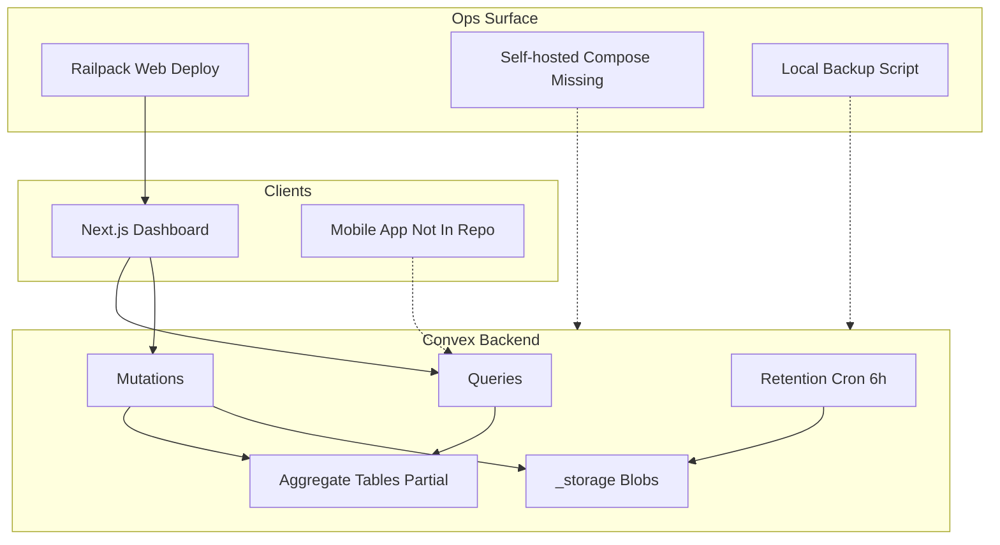

# Enterprise Architecture Audit

**Date:** 2026-07-21  
**Scope:** Repository-only static audit (no production telemetry)  
**Stack:** Convex (self-hosted intent), Next.js web, TypeScript monorepo, Dokploy/Railpack deployment  
**Status:** Audit complete — remediation not started

## Executive verdict

The application is **not production-ready for continuous multi-month self-hosted operation** under the stated goals (no timeouts, no isolate restarts, no unbounded storage growth, sub-500 ms dashboards, millions of records).

Static analysis found **verified correctness defects** (silent export truncation), **transaction blowups** (reassignment, import, demand-notice fan-out), an **incomplete analytics generation cutover**, **storage orphan/growth paths**, and a **missing self-hosted Convex deployment source of truth**. Several goals such as “never crashes” and “zero OCC conflicts” cannot be proven from the repository alone and remain **production verification targets**.

---

## 1. Architecture inventory

### 1.1 Schema (27 tables)

| Domain               | Tables                                                                                                                                                                                                                     |
| -------------------- | -------------------------------------------------------------------------------------------------------------------------------------------------------------------------------------------------------------------------- |
| Identity / tenancy   | `users`, `districts`, `municipalities`, `wards`, `userAllotments`                                                                                                                                                          |
| Field capture        | `surveys`, `floors`, `photos`                                                                                                                                                                                              |
| QC                   | `qcRemarks`, `qcDecisions`                                                                                                                                                                                                 |
| Masters / tax / RBAC | `masters`, `taxRates`, `permissions`, `roles`, `rolePermissions`                                                                                                                                                           |
| Ops                  | `auditLogs`, `notifications`, `demandNoticeExportJobs`                                                                                                                                                                     |
| Analytics aggregates | `surveyMunicipalityStats`, `surveyDailyStats`, `surveyWardStats`, `surveySurveyorStats`, `surveyDistrictStats`, `surveyQcReviewerStats`, `surveyAnalyticsContributions`, `qcAnalyticsContributions`, `surveyAnalyticsMeta` |

Notable index gaps for scale:

- No `users.by_municipality_status_role`
- No `surveys` municipality + propertyId compound
- No `surveys` municipality/district + submittedAt
- No normalized ward/parcel compound for sibling lookups
- `photos.by_storageId` is not unique (shared blob risk)

### 1.2 Callable surface (approximate)

| Kind               | Count | Notes                                                             |
| ------------------ | ----- | ----------------------------------------------------------------- |
| Public queries     | ~61   | Dashboard, surveys, QC, export, photos, admin, RBAC               |
| Public mutations   | ~49   | Surveys, QC, photos, floors, import, reassignment, demand notices |
| Internal mutations | ~9    | Retention, rollup backfill, Clerk sync, RBAC seed, audit backfill |
| HTTP actions       | 1     | Clerk webhook                                                     |
| Convex actions     | 0     | Heavy work stays in queries/mutations                             |
| Crons              | 1     | Retention every 6 hours                                           |

### 1.3 Clients and ops

| Surface                    | Present?    | Notes                                                                        |
| -------------------------- | ----------- | ---------------------------------------------------------------------------- |
| `apps/web`                 | Yes         | Sole application client in this monorepo                                     |
| Mobile app                 | **No**      | Referenced only in comments / ID conventions                                 |
| `railpack.json`            | Yes         | Web build/start; `HEALTHCHECK_PATH` is env only                              |
| Self-hosted Convex compose | **Missing** | README/docs claim `infra/convex-self-hosted/docker-compose.yml`; not in tree |
| Env templates              | **Missing** | `.env.example` files referenced but absent                                   |
| Backup script              | Yes         | Local ZIP export; no schedule/offsite/restore drill                          |

### 1.4 High-risk end-to-end flows

1. Survey draft save → analytics aggregate fan-out
2. Dashboard counts/analytics/QC/activity (four concurrent queries)
3. Bulk reassignment across municipalities
4. Excel import (40 surveys / 200 floors per mutation)
5. Excel export (client page 50 vs server slice 40)
6. Demand-notice bulk PDF (up to 1,500 notices in one query + browser memory)
7. Photo two-phase upload (URL → blob → link)
8. Retention + local backup
9. Analytics generation writers without cutover/backfill state machine

---

## 2. Findings register

Severity key:

- **P0 Critical** — correctness loss, likely timeout/crash under normal product limits, or irreversible data/storage failure modes
- **P1 High** — scalability / reliability blockers for production continuous operation
- **P2 Important** — material risk under growth; contract/observability gaps
- **P3 Moderate / Low** — domain-bounded today or hygiene

### 2.1 P0 Critical

| ID  | Issue                                                     | Evidence                                                                                                                                                         | Impact                                                         | Remediation                                                         |
| --- | --------------------------------------------------------- | ---------------------------------------------------------------------------------------------------------------------------------------------------------------- | -------------------------------------------------------------- | ------------------------------------------------------------------- |
| C1  | Excel export silently drops 10 IDs per 50-ID chunk        | Client chunks 50: `apps/web/.../survey-excel-actions.tsx`, `qc-final-report-export-button.tsx`; server slices to 40: `packages/backend/convex/export/queries.ts` | Silent undercount; progress UI can claim success               | Share one page size; reject oversized arrays; assert returned count |
| C2  | Demand-notice payload query fans out up to ~1,500 surveys | `demandNotices/mutations.ts` limit; `demandNotices/helpers.ts` `Promise.all` per survey (floors/photos/URLs); `getNoticePayloads`                                | SystemTimeout / UserTimeout / isolate pressure / huge payloads | Paginate 25–50; background PDF worker; stream parts                 |
| C3  | Reassignment mutation unbounded by overall work           | `reassignment/helpers.ts` take(300)/municipality; `reassignment/mutations.ts` sequential patch+analytics+notify+audit                                            | Mutation write/time limit → full rollback                      | Cap 10–25 IDs or paginated internal job with progress               |
| C4  | Excel import is one oversized transaction                 | `export/mutations.ts` 40 surveys + 200 floors + analytics fan-out                                                                                                | Timeout/OCC amplification; batch atomicity surprises           | Chunked import job; small fixed surveys per mutation                |

### 2.2 P1 High

| ID  | Issue                                            | Evidence                                                                                                                                              | Impact                                                           | Remediation                                                      |
| --- | ------------------------------------------------ | ----------------------------------------------------------------------------------------------------------------------------------------------------- | ---------------------------------------------------------------- | ---------------------------------------------------------------- |
| H1  | Analytics generation cutover incomplete          | Schema/writers present (`surveyAnalyticsMeta`, `surveyAnalyticsWrites.ts`); no init/backfill/activate/reader switch; readers still use legacy indexes | Dual generations unsafe; `.unique()` can throw; refactor dormant | Full generation state machine + generation-scoped readers        |
| H2  | Analytics silently truncates results             | ULB cap 12, users 200, rollups 40/400/500, survey fallback 2k/2.5k in `analytics/queries.ts`, `surveyRollupStats.ts`, `surveyScopeStats.ts`           | Dashboards/reports undercount without flag                       | Aggregate-only reads; expose `truncated`/`omittedCount`          |
| H3  | Aggregate documents are OCC hotspots             | Every survey transition patches municipality/district/daily/ward/surveyor; dual-generation writes                                                     | Concurrent saves retry/latency; imports amplify                  | Shard counters or append-event + async aggregate                 |
| H4  | Destructive rollup reset uses full collects      | `surveyRollupStats.clearAllRollupStats`; `stats/internal.ts`                                                                                          | Reset fails as tables grow                                       | Paginated delete / generation rebuild without wipe               |
| H5  | Offset “pagination” rescans prefixes             | `surveys/queries.listPaginated`; `export/queries.listForExport`                                                                                       | Later pages get slower; caps hide incompleteness                 | True Convex cursors + matching indexes                           |
| H6  | Two-phase uploads orphan blobs                   | Photos/PDF: upload URL → POST → link/complete; `releaseStorage` no-ops without photo row                                                              | Unbounded `_storage` growth                                      | Upload intents + orphan sweeper + server-side size/MIME check    |
| H7  | Blob size/type trusts client metadata            | `photos/mutations.linkPhoto` uses caller `sizeKb`; PDF complete skips metadata check                                                                  | Limit bypass; storage abuse                                      | Validate `_storage` metadata before link                         |
| H8  | Shared `storageId` not unique                    | Schema index only; link checks `(surveyId, slot)`                                                                                                     | Deleting one reference can break another                         | Enforce unique storage ownership                                 |
| H9  | Self-hosted Convex compose missing from Git      | Docs/README claim `infra/convex-self-hosted/docker-compose.yml`; not present                                                                          | Cannot reproduce persistence/restarts/limits from source         | Restore pinned compose + Dokploy runbook export                  |
| H10 | Backups are local, unscheduled, weakly validated | `backup-convex.mjs`                                                                                                                                   | Volume failure loses live + backup                               | Offsite encrypted scheduled exports + restore drills             |
| H11 | Dashboard SSR blocks on slowest of four queries  | `dashboard-content.tsx` `Promise.allSettled`                                                                                                          | Slow TTFB even when KPIs ready                                   | Suspense/stream per section or one bundle after aggregates ready |
| H12 | Bulk PDF holds entire job in browser memory      | `useDemandNoticeBulkPdf`, capture + 2× canvas JPEG + growing jsPDF                                                                                    | Tab OOM before backend finishes                                  | Server/worker PDF; chunked download                              |

### 2.3 P2 Important

| ID  | Issue                                                     | Evidence                                                                | Remediation                                |
| --- | --------------------------------------------------------- | ----------------------------------------------------------------------- | ------------------------------------------ |
| I1  | Missing `returns` validators across large API surface     | admin, audit, rbac, photos, floors, tenants, many survey/user funcs     | Add `returns` everywhere                   |
| I2  | Unbounded client arrays                                   | `photos.resolveStorageUrls`, `getUrls`, reassignment IDs, floor reorder | Hard reject over limits                    |
| I3  | `Date.now()` in demand-notice queries                     | `demandNotices/queries.ts`, helpers                                     | Require `nowMs`/`reportDateMs` arg         |
| I4  | Notification mark-all / unread count collect              | `masters/mutations.ts`, `masters/queries.ts`                            | Batch + unread counter                     |
| I5  | Fire-and-forget web promises                              | demand-notice progress/fail, report click handlers                      | Catch at event boundary                    |
| I6  | Upload/fetch without AbortSignal timeout                  | `usePhotos`, bulk PDF upload                                            | `AbortSignal.timeout`                      |
| I7  | Storage delete errors swallowed                           | `photos/helpers`, retention                                             | Tombstone + retry; suppress only not-found |
| I8  | Duplicate live subscriptions after preload                | audit/users/survey registry patterns                                    | Single `usePreloadedQuery` ownership       |
| I9  | Full survey documents for tables                          | `surveys/validators` list shape vs table columns                        | Compact registry projection                |
| I10 | Responsive tables double-render rows                      | QC/survey data tables desktop+mobile trees                              | Mount one layout                           |
| I11 | Audit logs / unread notifications never expire            | retention preserves unread; no audit purge                              | Compliance-backed retention policy         |
| I12 | Railpack `HEALTHCHECK_PATH` is not a Dokploy health check | `railpack.json`                                                         | Configure Swarm health check in Dokploy UI |
| I13 | Incomplete async lint enforcement on web                  | eslint config                                                           | Enable typed floating-promise rules        |

### 2.4 P3 Moderate / assumptions

- Tenant/RBAC/tax catalog `.collect()` acceptable only while catalogs stay small.
- Single retention cron is good hygiene but insufficient alone.
- No mobile app in repo — sync/offline goals cannot be audited here.
- SQLite WAL/VACUUM/ANALYZE are Convex-internal; do not run ad-hoc live PRAGMAs.

---

## 3. Production-readiness controls assessment

| Control                     | Status                | Notes                                                                                   |
| --------------------------- | --------------------- | --------------------------------------------------------------------------------------- |
| Auth on public data paths   | Mostly present        | `requireUser` / capabilities common                                                     |
| Arg validators              | Stronger than returns | Many functions still missing `returns`                                                  |
| Bounded inputs              | Weak                  | Several unbounded arrays; silent slicing elsewhere                                      |
| Idempotency                 | Partial               | Survey `(surveyorId, localId)`; analytics contributions designed but cutover incomplete |
| Job progress / resumability | Weak                  | Import/reassignment/backfill lack durable job state                                     |
| Retry policy                | Partial               | OCC retries on draft save; unsafe fire-and-forget elsewhere                             |
| Retention                   | Partial               | Exports + read notifications; not audits/orphans/unread                                 |
| Backup / restore            | Weak                  | Manual local ZIP; no restore drill                                                      |
| Health / readiness          | Partial               | Web `/health` liveness only                                                             |
| Resource / log limits       | Unknown               | Not in Git; Dokploy/host only                                                           |
| Observability               | Weak                  | Console logs; no structured slow-query/OCC/disk metrics in app                          |
| Deployment reproducibility  | Fail                  | Missing compose/env templates; Railpack version not pinned in repo                      |

### Evidence unavailable without production access

- Actual timeout/restart/OCC rates and p50/p95/p99
- Document and `_storage` cardinalities / volume sizes
- Active analytics generation metadata
- Dokploy health/restart/resource/log settings
- SQLite file size, WAL, checkpoint behavior
- Whether `backup-convex.mjs` runs anywhere
- Mobile sync latency (no mobile source)

---

## 4. Benchmark and verification protocol

### 4.1 Repository-verifiable gates (do now, before claiming readiness)

1. **Static**
   - `pnpm --filter @workspace/backend typecheck`
   - `pnpm --filter @workspace/backend lint`
   - `pnpm --filter web typecheck`
   - Grep gates: no historical analytics path reading `surveys`/`qcDecisions` after cutover; no unbounded `.collect()` on growing tables in hot paths; export page-size constants must match.
2. **Correctness tests to add**
   - Export: request 41/50/100 IDs → exact returned count or hard error
   - Import: chunk boundaries; partial failure isolation
   - Storage: oversized blob with lying `sizeKb` rejected; orphan intent sweep
   - Analytics: idempotent contribution retry; generation activate atomicity
   - Reassignment: hard work cap enforced
3. **Local fixture scale**
   - 100 municipalities, 5,000 surveyors, 180 daily rows/municipality
   - Target: `surveyStatsBreakdown` / dashboard bundle p95 &lt; 500 ms on warm aggregates
   - Demand-notice: prove 1,500 path fails or is rejected; prove 50-page path succeeds under memory budget

### 4.2 Production-only measurements (required for “months of uptime” claims)

| Metric                               | Gate                                                                     |
| ------------------------------------ | ------------------------------------------------------------------------ |
| Function timeouts / isolate restarts | 0 attributed to audited hot paths over 7 days                            |
| OCC permanent failures               | trending to near-zero on interactive saves                               |
| Bytes/docs read for dashboard        | within Convex soft thresholds                                            |
| Disk / volume growth                 | export retention + orphan sweep keep growth linear with domain data only |
| Backup restore drill                 | successful isolated restore quarterly                                    |
| Dashboard TTFB                       | KPI section &lt; 500 ms p95 when aggregates warm                         |

**Do not invent before/after numbers.** Record baselines when fixtures/prod access exist.

---

## 5. Phased remediation roadmap

Each program is independently reviewable. Do not merge programs into one mega-PR.

### Program 1 — Crash/timeout containment and export correctness (first)

- Fix Excel page-size contract (C1).
- Bound demand-notice payloads; move PDF generation off the giant query (C2/H12).
- Cap reassignment and convert bulk path to job (C3).
- Chunk Excel import (C4).
- Add AbortSignal + handled promise boundaries on export UI (I5/I6).

**Exit:** no silent truncation; product max batch sizes pass without timeout in fixtures.

### Program 2 — Analytics generation completion and OCC-safe aggregation

- Finish generation state machine: build → backfill → validate → activate → retire (H1).
- Switch readers to generation-scoped indexes; remove silent caps or expose truncation (H2).
- Replace dual-generation interactive fan-out / hot single docs with sharded or async aggregation (H3).
- Replace destructive reset (H4).
- Complete prior design: `docs/superpowers/specs/2026-07-21-convex-analytics-refactor-design.md`.

**Exit:** dashboard historical KPIs read only aggregates; p95 &lt; 500 ms on fixture; no survey scan for KPIs.

### Program 3 — Bounded background jobs

- Import, reassignment, QC backfill, audit backfill: cursor + progress document + internal scheduler chains.
- Never thousands of writes in one mutation.

### Program 4 — Storage intents, orphan cleanup, retention, backups

- Upload intent table; server metadata validation (H6/H7/H8).
- Deletion tombstones + retry; orphan reconciler.
- Audit/unread retention policy (I11).
- Scheduled offsite encrypted backups + restore drill (H10).

### Program 5 — Indexed registry/QC APIs and web rendering

- Cursor pagination (H5); missing indexes (section 1.1).
- Compact list projections (I9).
- Stream dashboard sections (H11); fix double-render tables (I10); single preload ownership (I8).

### Program 6 — Reproducible self-hosted ops and observability

- Restore compose with pinned images, volumes, health, restart, resources (H9).
- Dokploy health/restart/log rotation checklist (I12).
- Structured logging: mutation/query timing, OCC, storage delete failures, job duration.
- **SQLite:** treat as Convex-owned; no ad-hoc live VACUUM/PRAGMA without version-specific guidance and verified export.

### Program 7 — Mobile/offline (blocked)

- Provide mobile repository path. Until then, web draft queue remains process-local and non-durable (`useSurveys` OCC retry / in-memory queue).

---

## 6. Explicit non-claims

Static audit **cannot** certify:

- Convex backend never crashes
- No isolate restarts forever
- Zero UserTimeout / SystemTimeout / OCC in production
- Dashboard always &lt; 500 ms for all tenants
- Storage growth is controlled in the live volume
- Mobile sync works

Those require Programs 1–6 implementation **plus** production telemetry and restore drills.

---

## 7. Immediate priority order (ops + engineering)

1. Stop silent Excel truncation (C1) — correctness incident.
2. Cap/disable 1,500 demand-notice single-query path (C2/H12).
3. Cap reassignment and import batch sizes (C3/C4).
4. Restore self-hosted deployment config to Git and verify volume persistence (H9).
5. Automate offsite backups + one restore test (H10).
6. Finish analytics generation cutover before leaning on new tables (H1–H4).
7. Ship storage intent/orphan cleanup before volume fills (H6–H8).

---

## 8. Companion artifacts

- Interactive findings canvas: Cursor canvases directory `enterprise-architecture-audit.canvas.tsx`
- Prior analytics design (in progress, incomplete vs this audit’s H1): `docs/superpowers/specs/2026-07-21-convex-analytics-refactor-design.md`
- Prior analytics implementation plan: `docs/superpowers/plans/2026-07-21-convex-analytics-refactor.md`
